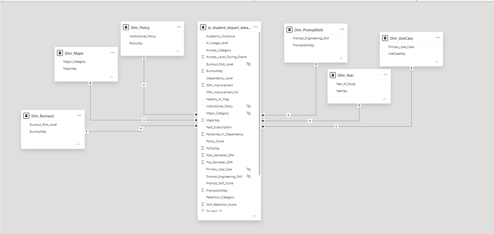
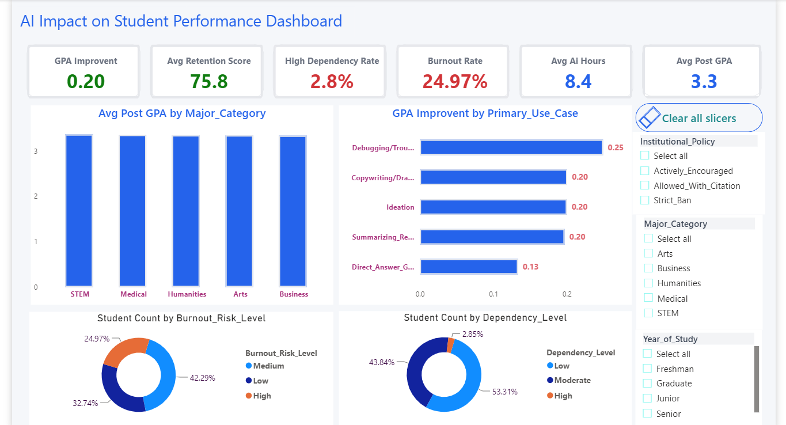
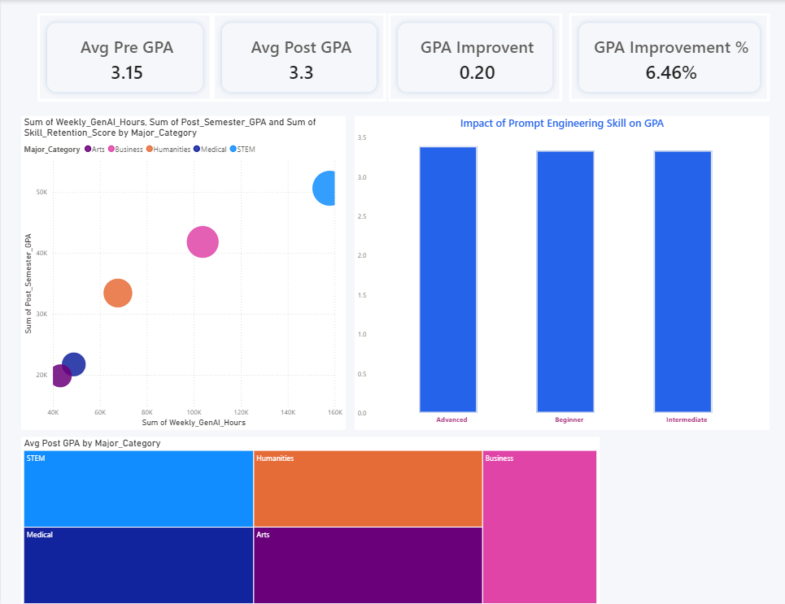
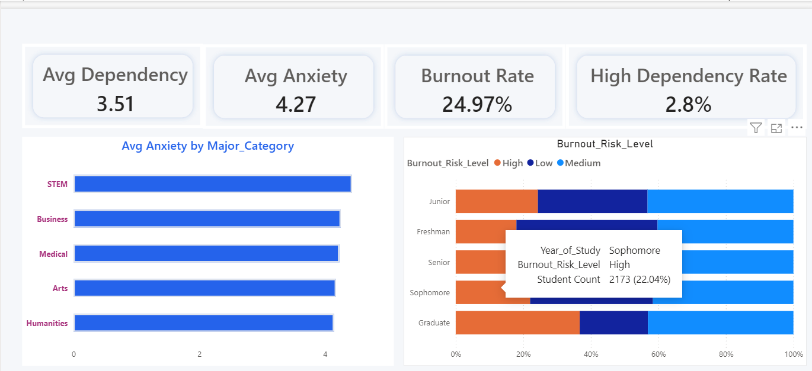
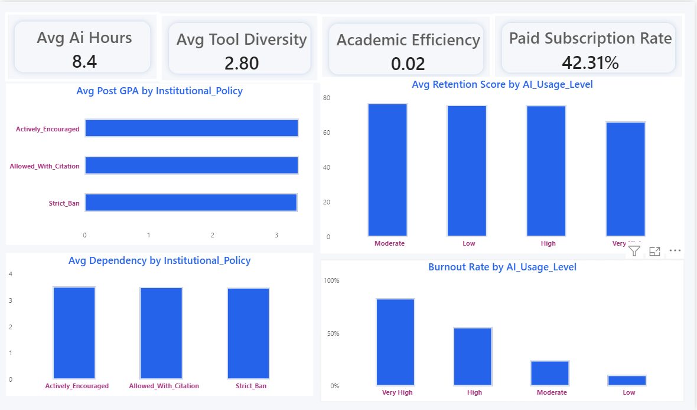

# ai_student_impact_dataset


# Phase 1 — Data Understanding

## Overview

Before building any dashboard, complete understanding of dataset required. Phase focuses on examining dataset structure, validating data quality, identifying business entities, and preparing foundation for analysis. No dashboard design or visualization decisions made during this phase.

---

# Objective

Primary objective:

- Understand dataset structure.
- Validate data quality.
- Identify dimensions and measures.
- Detect missing values, duplicates, and outliers.
- Build complete Data Audit Report.
- Translate technical columns into business language.

Without strong data understanding, dashboard insights become unreliable.

---

# Dataset Summary

| Metric | Value |
|---------|------:|
| Total Rows | 50,000 |
| Total Columns | 16 |
| Missing Values | 0 |
| Duplicate Records | 0 |
| Null Values | 0 |
| Primary Key | Student_ID |

Dataset quality assessed as **Excellent**.

---

# Dataset Structure

| Column | Data Type |
|---------|-----------|
| Student_ID | Whole Number |
| Major_Category | Text |
| Year_of_Study | Text |
| Pre_Semester_GPA | Decimal Number |
| Weekly_GenAI_Hours | Decimal Number |
| Primary_Use_Case | Text |
| Prompt_Engineering_Skill | Text |
| Tool_Diversity | Whole Number |
| Paid_Subscription | True / False |
| Traditional_Study_Hours | Decimal Number |
| Perceived_AI_Dependency | Whole Number |
| Institutional_Policy | Text |
| Anxiety_Level_During_Exams | Whole Number |
| Post_Semester_GPA | Decimal Number |
| Skill_Retention_Score | Decimal Number |
| Burnout_Risk_Level | Text |

---

# Data Quality Assessment

## Missing Values

Dataset contains no missing values.

| Metric | Result |
|---------|-------:|
| Missing Records | 0 |
| Missing Percentage | 0% |

No imputation required.

---

## Null Value Assessment

No null values detected.

Dataset ready for modeling.

---

## Duplicate Assessment

Duplicate records checked using Student_ID.

Result:

- Duplicate Rows : 0
- Duplicate Student_ID : 0

No duplicate removal required.

---

## Outlier Assessment

Outlier analysis performed using numerical fields.

Outliers identified in:

- Weekly_GenAI_Hours
- Pre_Semester_GPA
- Post_Semester_GPA
- Skill_Retention_Score
- Traditional_Study_Hours

These observations represent genuine student behavior rather than data errors, therefore retained.

---

# Unique Value Summary

| Column | Unique Values |
|---------|--------------:|
| Student_ID | 50,000 |
| Major_Category | 5 |
| Year_of_Study | 5 |
| Primary_Use_Case | 5 |
| Prompt_Engineering_Skill | 3 |
| Tool_Diversity | 5 |
| Paid_Subscription | 2 |
| Institutional_Policy | 3 |
| Burnout_Risk_Level | 3 |

---

# Business Meaning of Columns

### Student_ID

Unique identifier assigned to each student.

Business Role:

Primary Key.

---

### Major_Category

Academic discipline of student.

Examples:

- STEM
- Business
- Medical
- Humanities
- Arts

Business Role:

Dimension.

---

### Year_of_Study

Current academic level.

Examples:

- Freshman
- Sophomore
- Junior
- Senior
- Graduate

Business Role:

Dimension.

---

### Pre_Semester_GPA

Student GPA before GenAI adoption.

Business Role:

Baseline performance metric.

---

### Weekly_GenAI_Hours

Average hours spent using Generative AI every week.

Business Role:

AI adoption measure.

---

### Primary_Use_Case

Primary reason for AI usage.

Examples:

- Research
- Coding
- Summarization
- Writing
- Brainstorming

Business Role:

Dimension.

---

### Prompt_Engineering_Skill

Student ability to write effective AI prompts.

Business Role:

Capability dimension.

---

### Tool_Diversity

Number of AI tools regularly used.

Business Role:

Technology adoption metric.

---

### Paid_Subscription

Indicates whether student uses premium AI tools.

Business Role:

Adoption indicator.

---

### Traditional_Study_Hours

Average weekly study hours without AI assistance.

Business Role:

Behavioral metric.

---

### Perceived_AI_Dependency

Self-reported dependency score.

Scale:

1–10

Business Role:

Risk metric.

---

### Institutional_Policy

University policy governing AI usage.

Business Role:

Governance dimension.

---

### Anxiety_Level_During_Exams

Student anxiety score during examinations.

Scale:

1–10

Business Role:

Well-being metric.

---

### Post_Semester_GPA

Student GPA after semester.

Business Role:

Primary outcome KPI.

---

### Skill_Retention_Score

Knowledge retained after learning.

Business Role:

Educational effectiveness KPI.

---

### Burnout_Risk_Level

Student burnout classification.

Examples:

- Low
- Medium
- High

Business Role:

Risk dimension.

---

# Data Classification

## Fact

Student academic performance and AI usage.

---

## Dimensions

- Student_ID
- Major_Category
- Year_of_Study
- Primary_Use_Case
- Prompt_Engineering_Skill
- Paid_Subscription
- Institutional_Policy
- Burnout_Risk_Level

---

## Measures

- Pre_Semester_GPA
- Post_Semester_GPA
- Weekly_GenAI_Hours
- Traditional_Study_Hours
- Tool_Diversity
- Perceived_AI_Dependency
- Anxiety_Level_During_Exams
- Skill_Retention_Score

---

## Numerical Columns

- Pre_Semester_GPA
- Weekly_GenAI_Hours
- Tool_Diversity
- Traditional_Study_Hours
- Perceived_AI_Dependency
- Anxiety_Level_During_Exams
- Post_Semester_GPA
- Skill_Retention_Score

---

## Categorical Columns

- Major_Category
- Year_of_Study
- Primary_Use_Case
- Prompt_Engineering_Skill
- Paid_Subscription
- Institutional_Policy
- Burnout_Risk_Level

---

# Key Observations

- Dataset contains high-quality records.
- Missing values absent.
- Duplicate records absent.
- Student_ID uniquely identifies every student.
- Multiple categorical dimensions available for segmentation.
- Multiple numerical measures available for KPI development.
- Dataset suitable for executive dashboard development.

---

# Phase 2 — Business Understanding

## Overview

Business Understanding transforms raw data into meaningful business context. Rather than focusing on technical fields, this phase identifies business objectives, stakeholder expectations, strategic questions, opportunities, and potential risks. The purpose is to ensure the dashboard answers real business problems instead of simply displaying data.

---

# Objective

Primary objectives:

- Understand business context.
- Identify organizational goals.
- Define stakeholder requirements.
- Discover business opportunities.
- Identify operational risks.
- Formulate analytical questions.
- Establish dashboard direction.

This phase determines **what decisions the dashboard should support** before designing any visuals.

---

# Business Context

Generative Artificial Intelligence (GenAI) has become an essential academic tool for students. Universities increasingly encourage, regulate, or restrict AI usage depending on institutional policies.

This dataset investigates whether AI usage positively impacts academic performance while maintaining healthy learning behaviors.

The analysis focuses on balancing four key areas:

- Academic Performance
- AI Adoption
- Learning Retention
- Student Well-being

---

# Business Problem

Universities are rapidly adopting AI technologies, yet uncertainty remains regarding their educational impact.

Key concerns include:

- Does AI genuinely improve academic performance?
- Does excessive AI usage create dependency?
- Is knowledge retention affected?
- Does AI increase burnout or reduce traditional learning?

Leadership requires reliable evidence before defining long-term AI policies.

---

# Problem Statement

Educational institutions require data-driven insights to determine whether AI improves student outcomes without negatively affecting knowledge retention, independent learning, or student well-being.

Without analytical evidence, policy decisions may either over-restrict beneficial technologies or encourage harmful usage patterns.

---

# Business Goal

Develop an executive dashboard capable of:

- Measuring academic outcomes.
- Monitoring AI adoption.
- Identifying dependency risks.
- Evaluating institutional policies.
- Supporting evidence-based decision making.

---

# Stakeholders

## University Leadership

Responsibilities:

- Strategic planning
- Academic performance
- AI governance

Questions:

- Should AI adoption increase?
- Which policy works best?
- Are students benefiting?

---

## Academic Deans

Responsibilities:

- Faculty performance
- Curriculum quality

Questions:

- Which departments perform best?
- Which majors benefit most?

---

## Faculty Members

Responsibilities:

- Teaching quality
- Student learning

Questions:

- Does AI improve learning?
- Does prompt engineering matter?

---

## Student Success Teams

Responsibilities:

- Student welfare
- Academic support

Questions:

- Which students require intervention?
- Which groups experience burnout?

---

## Policy Makers

Responsibilities:

- Institutional governance
- AI regulations

Questions:

- Which policy delivers best outcomes?
- Should AI usage be encouraged or restricted?

---

## Education Researchers

Responsibilities:

- Educational research
- Learning effectiveness

Questions:

- Does AI improve learning retention?
- What behavioral patterns exist?

---

# Dataset Story

Dataset examines relationship between:

```text
GenAI Usage
        ↓
Study Behavior
        ↓
Academic Performance
        ↓
Learning Retention
        ↓
Dependency
        ↓
Burnout
```

Primary narrative:

Students increasingly rely on AI during learning. Analysis determines whether this dependency enhances academic success or introduces educational risks.

---

# Business Questions

## Executive Priority

1. Does AI improve academic performance?
2. How much GPA improvement occurs after AI adoption?
3. What AI usage level produces best academic outcomes?
4. Does excessive AI usage reduce knowledge retention?
5. Does AI dependency increase burnout?
6. Which majors benefit most from AI?
7. Which majors face greatest risks?
8. Which institutional policy delivers strongest outcomes?
9. Do paid AI users outperform free users?
10. Does prompt engineering improve academic performance?

---

## Operational Priority

11. Which AI use cases produce highest GPA?
12. How does AI affect traditional study habits?
13. Which year of study benefits most?
14. Which year experiences highest burnout?
15. Which students have highest dependency?
16. Does tool diversity improve learning?
17. Which students retain knowledge best?
18. Which policies reduce dependency?
19. Does anxiety correlate with GPA?
20. What factors predict academic success?

---

# Business Opportunities

## Opportunity 1

Optimize AI usage guidelines.

Identify healthy AI usage range maximizing GPA while maintaining learning retention.

---

## Opportunity 2

Improve institutional policies.

Compare policy effectiveness using measurable academic outcomes.

---

## Opportunity 3

Develop prompt engineering training.

Identify whether better prompting improves academic performance.

---

## Opportunity 4

Early intervention.

Identify students showing signs of dependency or burnout before academic performance declines.

---

## Opportunity 5

Enhance curriculum design.

Understand how AI complements traditional learning methods.

---

# Business Risks

## Risk 1

Excessive AI dependency reducing independent thinking.

---

## Risk 2

Declining knowledge retention despite higher GPA.

---

## Risk 3

Academic integrity concerns.

---

## Risk 4

Burnout among heavy AI users.

---

## Risk 5

Ineffective institutional AI policies.

---

# Hidden Patterns to Investigate

Potential relationships:

```text
Higher AI Hours
        ↓
Higher GPA
```

```text
Higher AI Hours
        ↓
Higher Dependency
```

```text
Higher Dependency
        ↓
Lower Retention
```

```text
Advanced Prompt Skills
        ↓
Higher GPA
```

```text
More AI Tools
        ↓
Better Academic Performance
```

```text
Supportive Policy
        ↓
Higher AI Adoption
```

These hypotheses require validation through dashboard analysis.

---

# Business Success Metrics

Successful implementation should enable leadership to:

- Measure GPA improvement.
- Track AI adoption.
- Monitor dependency levels.
- Evaluate burnout risk.
- Assess learning retention.
- Compare institutional policies.
- Identify high-performing student groups.

---

# Dashboard Success Criteria

Dashboard considered successful if executives can answer:

- Is AI helping students?
- Who benefits most?
- Who is at risk?
- Which policy performs best?
- What level of AI usage is healthy?
- Where should interventions occur?

within a few minutes.

---

# Expected Business Outcomes

Following dashboard implementation, leadership should be able to:

- Make evidence-based AI policy decisions.
- Improve academic performance.
- Reduce dependency risks.
- Increase learning effectiveness.
- Support student well-being.
- Allocate educational resources efficiently.

---

# Phase 3 — KPI Discovery

## Overview

After establishing business objectives, the next step is identifying Key Performance Indicators (KPIs). KPIs convert raw data into measurable business metrics that allow executives to evaluate academic performance, AI adoption, learning effectiveness, and student well-being.

This phase defines the metrics that drive the entire dashboard and ensures every visual supports a business decision.

---

# Objective

Primary objectives:

- Identify business-critical KPIs.
- Develop reusable DAX measures.
- Measure academic performance.
- Measure AI adoption.
- Measure student dependency.
- Measure learning retention.
- Measure burnout risk.
- Build executive KPI framework.

---

# KPI Strategy

KPIs divided into five business domains.

- Academic Performance
- AI Adoption
- Learning Effectiveness
- Dependency Risk
- Student Well-being

This structure allows leadership to evaluate both educational success and potential risks.

---

# KPI 1 — Average Post Semester GPA

## Business Meaning

Represents average student GPA after semester completion.

Primary academic performance indicator.

## Formula

Average(Post_Semester_GPA)

## DAX

```DAX
Avg Post GPA =
AVERAGE('ai_student_impact_dataset (1)'[Post_Semester_GPA])
```

## Business Importance

Measures overall academic success.

---

# KPI 2 — Average Pre Semester GPA

## Business Meaning

Baseline GPA before AI adoption.

## Formula

Average(Pre_Semester_GPA)

## DAX

```DAX
Avg Pre GPA =
AVERAGE('ai_student_impact_dataset (1)'[Pre_Semester_GPA])
```

## Business Importance

Provides benchmark for comparison.

---

# KPI 3 — GPA Improvement

## Business Meaning

Average improvement in GPA after AI adoption.

## Formula

Post GPA − Pre GPA

## DAX

```DAX
GPA Improvement =
[Avg Post GPA] - [Avg Pre GPA]
```

## Business Importance

Measures educational impact of AI.

---

# KPI 4 — GPA Improvement %

## Business Meaning

Relative academic improvement.

## Formula

(GPA Improvement ÷ Avg Pre GPA) × 100

## DAX

```DAX
GPA Improvement % =
DIVIDE(
[GPA Improvement],
[Avg Pre GPA],
0
)
```

## Business Importance

Allows comparison across student groups.

---

# KPI 5 — Average Weekly AI Hours

## Business Meaning

Average weekly AI usage.

## DAX

```DAX
Avg AI Hours =
AVERAGE('ai_student_impact_dataset (1)'[Weekly_GenAI_Hours])
```

## Business Importance

Measures AI adoption intensity.

---

# KPI 6 — Average Skill Retention Score

## Business Meaning

Average retained knowledge after learning.

## DAX

```DAX
Avg Retention Score =
AVERAGE('ai_student_impact_dataset (1)'[Skill_Retention_Score])
```

## Business Importance

Measures long-term educational effectiveness.

---

# KPI 7 — Average Dependency Score

## Business Meaning

Average perceived AI dependency.

## DAX

```DAX
Avg Dependency =
AVERAGE('ai_student_impact_dataset (1)'[Perceived_AI_Dependency])
```

## Business Importance

Measures reliance on AI.

---

# KPI 8 — High Dependency Rate

## Business Meaning

Percentage of students reporting dependency scores ≥8.

## DAX

```DAX
High Dependency Students =
CALCULATE(
COUNTROWS('ai_student_impact_dataset (1)'),
'ai_student_impact_dataset (1)'[Perceived_AI_Dependency] >= 8
)

High Dependency Rate =
DIVIDE(
[High Dependency Students],
COUNTROWS('ai_student_impact_dataset (1)')
)
```

## Business Importance

Executive risk indicator.

---

# KPI 9 — Average Anxiety Score

## Business Meaning

Average examination anxiety.

## DAX

```DAX
Avg Anxiety =
AVERAGE('ai_student_impact_dataset (1)'[Anxiety_Level_During_Exams])
```

## Business Importance

Measures student well-being.

---

# KPI 10 — Burnout Rate

## Business Meaning

Percentage of students classified as High Burnout.

## DAX

```DAX
High Burnout Students =
CALCULATE(
COUNTROWS('ai_student_impact_dataset (1)'),
'ai_student_impact_dataset (1)'[Burnout_Risk_Level]="High"
)

Burnout Rate =
DIVIDE(
[High Burnout Students],
COUNTROWS('ai_student_impact_dataset (1)')
)
```

## Business Importance

Critical risk indicator.

---

# KPI 11 — Paid Subscription Rate

## Business Meaning

Percentage of students using premium AI tools.

## DAX

```DAX
Paid Subscribers =
CALCULATE(
COUNTROWS('ai_student_impact_dataset (1)'),
'ai_student_impact_dataset (1)'[Paid_Subscription]=TRUE()
)

Paid Subscription Rate =
DIVIDE(
[Paid Subscribers],
COUNTROWS('ai_student_impact_dataset (1)')
)
```

## Business Importance

Measures premium AI adoption.

---

# KPI 12 — Average Tool Diversity

## Business Meaning

Average number of AI tools used.

## DAX

```DAX
Avg Tool Diversity =
AVERAGE('ai_student_impact_dataset (1)'[Tool_Diversity])
```

## Business Importance

Measures AI ecosystem maturity.

---

# KPI Framework

## Academic Performance

- Avg Post GPA
- Avg Pre GPA
- GPA Improvement
- GPA Improvement %

---

## AI Adoption

- Avg AI Hours
- Paid Subscription Rate
- Avg Tool Diversity

---

## Learning Effectiveness

- Avg Retention Score

---

## Dependency Risk

- Avg Dependency
- High Dependency Rate

---

## Student Well-being

- Avg Anxiety
- Burnout Rate

---

# Executive KPI Cards

Dashboard homepage displays only six KPIs.

- Avg Post GPA
- GPA Improvement
- Avg Retention Score
- High Dependency Rate
- Burnout Rate
- Avg AI Hours

These provide complete executive summary within five seconds.

---

# KPI Validation

Measures validated after implementation.

| KPI | Result |
|------|--------|
| Avg Post GPA | 3.35 |
| GPA Improvement | 0.20 |
| Avg Retention Score | 75.80 |
| High Dependency Rate | 2.85% |
| Burnout Rate | 24.97% |
| Avg AI Hours | 8.43 |

Results consistent with dataset and business expectations.

---

# Business Insights Enabled

KPIs answer questions such as:

- Is AI improving GPA?
- Are students becoming dependent?
- Is learning retention healthy?
- What percentage of students experience burnout?
- How heavily do students use AI?
- Are current institutional policies effective?

---

# Phase 4 — Data Modeling

## Overview

Data Modeling is the foundation of every Power BI solution. A well-designed model improves report performance, simplifies DAX calculations, reduces redundancy, and enables scalable dashboard development.

This project follows a **Star Schema**, the industry standard recommended by Microsoft for analytical reporting.

---

# Objective

Primary objectives:

- Organize data into Fact and Dimension tables.
- Reduce data redundancy.
- Improve query performance.
- Simplify DAX calculations.
- Build scalable architecture.
- Follow Microsoft Power BI best practices.

---

# Why Star Schema?

Star Schema separates descriptive information from measurable data.

Benefits:

- Faster report performance.
- Easier DAX development.
- Better filter propagation.
- Simplified maintenance.
- Industry-standard architecture.

---

# Data Model Architecture

```
                 Dim_Major
                     |
                     |
Dim_Year ---- 'ai_student_impact_dataset (1)' ---- Dim_UseCase
                     |
                     |
             Dim_PromptSkill
                     |
                     |
                Dim_Policy
                     |
                     |
               Dim_Burnout
```

---

# Fact Table

Table Name

```
'ai_student_impact_dataset (1)'
```

Purpose

Stores all measurable student information.

Contains

```
Student_ID
MajorKey
YearKey
UseCaseKey
PromptSkillKey
PolicyKey
BurnoutKey
Pre_Semester_GPA
Post_Semester_GPA
Weekly_GenAI_Hours
Traditional_Study_Hours
Tool_Diversity
Perceived_AI_Dependency
Anxiety_Level_During_Exams
Skill_Retention_Score
Paid_Subscription
```

Fact Table Characteristics

- Largest table
- Transaction-level data
- Contains numerical measures
- Connected to all dimensions

---

# Dimension Tables

## Dim_Major

Purpose

Stores academic disciplines.

Columns

```
MajorKey
Major_Category
```

---

## Dim_Year

Purpose

Stores academic levels.

Columns

```
YearKey
Year_of_Study
```

---

## Dim_UseCase

Purpose

Stores primary AI usage purpose.

Columns

```
UseCaseKey
Primary_Use_Case
```

---

## Dim_PromptSkill

Purpose

Stores AI prompt engineering skill level.

Columns

```
PromptSkillKey
Prompt_Engineering_Skill
```

---

## Dim_Policy

Purpose

Stores institutional AI policies.

Columns

```
PolicyKey
Institutional_Policy
```

---

## Dim_Burnout

Purpose

Stores burnout classification.

Columns

```
BurnoutKey
Burnout_Risk_Level
```

---

# Relationships

## Relationship 1

```
Dim_Major[MajorKey]
          1
          |
          *
Fact_Student_AI[MajorKey]
```

Cardinality

```
One-to-Many
```

Cross Filter

```
Single
```

---

## Relationship 2

```
Dim_Year[YearKey]
         1
         |
         *
Fact_Student_AI[YearKey]
```

---

## Relationship 3

```
Dim_UseCase[UseCaseKey]
            1
            |
            *
Fact_Student_AI[UseCaseKey]
```

---

## Relationship 4

```
Dim_PromptSkill[PromptSkillKey]
                1
                |
                *
Fact_Student_AI[PromptSkillKey]
```

---

## Relationship 5

```
Dim_Policy[PolicyKey]
           1
           |
           *
Fact_Student_AI[PolicyKey]
```

---

## Relationship 6

```
Dim_Burnout[BurnoutKey]
             1
             |
             *
Fact_Student_AI[BurnoutKey]
```

---

# Relationship Summary

| Dimension | Fact | Cardinality | Cross Filter |
|------------|------|-------------|--------------|
| Dim_Major | Fact_Student_AI | 1:* | Single |
| Dim_Year | Fact_Student_AI | 1:* | Single |
| Dim_UseCase | Fact_Student_AI | 1:* | Single |
| Dim_PromptSkill | Fact_Student_AI | 1:* | Single |
| Dim_Policy | Fact_Student_AI | 1:* | Single |
| Dim_Burnout | Fact_Student_AI | 1:* | Single |

---

# Why Single Direction?

Advantages

- Faster calculations.
- Avoids ambiguous relationships.
- Prevents circular filtering.
- Microsoft best practice.

---

# Measures Table

Separate table created for all DAX measures.

Table Name

```
Measures
```

Purpose

- Centralize calculations.
- Improve report organization.
- Simplify maintenance.

Contains

```
Avg Post GPA
Avg Pre GPA
GPA Improvement
GPA Improvement %
Avg AI Hours
Avg Retention Score
Avg Dependency
High Dependency Rate
Burnout Rate
Paid Subscription Rate
Academic Efficiency
```

---

# Hidden Columns

To reduce report clutter, descriptive columns inside Fact table hidden from Report View.

Hidden Columns

```
Major_Category
Year_of_Study
Primary_Use_Case
Prompt_Engineering_Skill
Institutional_Policy
Burnout_Risk_Level
```

Users interact only through Dimension tables.

---

# Modeling Best Practices

Implemented

- Star Schema
- Separate Fact Table
- Separate Dimension Tables
- Single-direction relationships
- One-to-Many relationships
- Dedicated Measures table
- Hidden duplicate columns
- Business-friendly table names

---

# Business Benefits

Current model enables:

- Fast filtering.
- Better slicer performance.
- Reusable DAX measures.
- Easier dashboard expansion.
- Scalable architecture.
- Enterprise-grade reporting.

---

# Phase Outcome

Phase 4 transformed raw dataset into an optimized analytical model using Star Schema architecture. Fact and Dimension tables were separated, relationships established using one-to-many cardinality with single-direction filtering, and dedicated Measures table created for DAX calculations. This model provides scalable, high-performance foundation for Power BI dashboard development.

---

# Phase 5 — Power Query Transformations

## Overview

Power Query is Power BI's Extract, Transform, and Load (ETL) engine. This phase focused on validating dataset quality and performing only the transformations required to support business analysis and dashboard development.

Unlike many real-world datasets, this dataset was already clean and required minimal preprocessing.

---

# Objective

Primary objectives:

- Validate data quality.
- Verify data types.
- Remove unnecessary inconsistencies.
- Create business-ready calculated columns.
- Prepare dataset for DAX calculations.
- Optimize data for reporting.

---

# Why Power Query?

Power Query allows transformations to occur before data reaches the data model.

Benefits include:

- Faster report performance.
- Cleaner data model.
- Reduced DAX complexity.
- Improved data consistency.
- Reusable ETL process.

---

# Data Validation

The dataset was examined before any transformation.

| Validation Check | Status |
|------------------|--------|
| Missing Values | None |
| Null Values | None |
| Duplicate Records | None |
| Invalid Data Types | None |
| Blank Records | None |

Result:

Dataset quality considered excellent.

---

# Data Type Verification

Verified all columns use correct data types.

| Column | Data Type |
|---------|-----------|
| Student_ID | Whole Number |
| Major_Category | Text |
| Year_of_Study | Text |
| Pre_Semester_GPA | Decimal Number |
| Weekly_GenAI_Hours | Decimal Number |
| Primary_Use_Case | Text |
| Prompt_Engineering_Skill | Text |
| Tool_Diversity | Whole Number |
| Paid_Subscription | True / False |
| Traditional_Study_Hours | Decimal Number |
| Perceived_AI_Dependency | Whole Number |
| Institutional_Policy | Text |
| Anxiety_Level_During_Exams | Whole Number |
| Post_Semester_GPA | Decimal Number |
| Skill_Retention_Score | Decimal Number |
| Burnout_Risk_Level | Text |

---

# Duplicate Validation

Student_ID used as unique identifier.

Validation Result

- Duplicate Student_ID : 0
- Duplicate Rows : 0

No duplicate removal required.

---

# Null Validation

Every column inspected.

Result

- Null Values : 0
- Missing Values : 0

No replacement or imputation required.

---

# Text Standardization

Applied text formatting to categorical columns.

Operations performed:

- Trim
- Clean

Applied to:

- Major_Category
- Year_of_Study
- Primary_Use_Case
- Prompt_Engineering_Skill
- Institutional_Policy
- Burnout_Risk_Level

Purpose

Remove leading spaces, trailing spaces, and hidden characters.

---

# Business Columns Created

## GPA Improvement

Purpose

Measures academic improvement after AI adoption.

Formula

```powerquery
[Post_Semester_GPA] - [Pre_Semester_GPA]
```

---

## GPA Improvement Percentage

Purpose

Measures percentage increase in GPA.

Formula

```powerquery
([Post_Semester_GPA]-[Pre_Semester_GPA])/[Pre_Semester_GPA]
```

---

## AI Usage Level

Purpose

Groups students according to weekly AI usage.

Categories

- Low
- Moderate
- High
- Very High

Formula

```powerquery
if [Weekly_GenAI_Hours] < 5 then "Low"
else if [Weekly_GenAI_Hours] < 15 then "Moderate"
else if [Weekly_GenAI_Hours] < 25 then "High"
else "Very High"
```

---

## Dependency Level

Purpose

Segments students by AI dependency.

Categories

- Low
- Moderate
- High

Formula

```powerquery
if [Perceived_AI_Dependency] <= 3 then "Low"
else if [Perceived_AI_Dependency] <= 7 then "Moderate"
else "High"
```

---

## Anxiety Category

Purpose

Groups examination anxiety into meaningful business categories.

Categories

- Low
- Moderate
- High

Formula

```powerquery
if [Anxiety_Level_During_Exams] <= 3 then "Low"
else if [Anxiety_Level_During_Exams] <= 7 then "Moderate"
else "High"
```

---

## Retention Category

Purpose

Segments students by learning retention.

Categories

- Excellent
- Good
- Poor

Formula

```powerquery
if [Skill_Retention_Score] >= 80 then "Excellent"
else if [Skill_Retention_Score] >= 60 then "Good"
else "Poor"
```

---

## Healthy AI Flag

Purpose

Identifies students demonstrating healthy AI usage.

Categories

- Healthy
- Risk

Formula

```powerquery
if [Perceived_AI_Dependency] < 7
and [Skill_Retention_Score] > 70
and [Burnout_Risk_Level] <> "High"
then "Healthy"
else "Risk"
```

---

# Data Refresh

After transformations:

- Close & Apply executed.
- Updated model loaded into Power BI.
- Changes propagated to Data Model.

---

# ETL Pipeline

```
Raw Dataset
      │
      ▼
Import into Power Query
      │
      ▼
Validate Data Types
      │
      ▼
Validate Missing Values
      │
      ▼
Validate Duplicates
      │
      ▼
Clean Text Columns
      │
      ▼
Create Business Columns
      │
      ▼
Close & Apply
      │
      ▼
Power BI Data Model
```

---

# Business Benefits

Transformations provide:

- Cleaner reporting.
- Better segmentation.
- Reduced DAX complexity.
- Faster dashboard performance.
- Improved business interpretation.

---

# Best Practices Applied

- Verified data types.
- Preserved raw values.
- Avoided unnecessary transformations.
- Created reusable business categories.
- Maintained data integrity.
- Optimized model before DAX development.

---

# Phase Outcome

Phase 5 validated dataset quality and prepared business-ready data using Power Query. Data types were verified, text fields standardized, and business segmentation columns created to support executive reporting. Dataset entered Power BI model in optimized state, ready for advanced DAX calculations and dashboard development.

---

# Phase 6 — DAX Development

## Overview

Data Analysis Expressions (DAX) is Power BI's analytical calculation language used to create dynamic measures, KPIs, aggregations, rankings, percentages, and business calculations.

Unlike calculated columns, DAX measures are evaluated dynamically based on user selections, filters, slicers, and report interactions.

This phase transforms raw data into meaningful business intelligence.

---

# Objective

Primary objectives:

- Build reusable DAX measures.
- Develop executive KPIs.
- Calculate dynamic business metrics.
- Support interactive filtering.
- Enable drill-down analysis.
- Improve dashboard flexibility.

---

# Why DAX?

DAX enables:

- Dynamic calculations.
- Context-aware metrics.
- Faster business analysis.
- Interactive reporting.
- Executive KPI tracking.

---

# DAX Categories

Measures divided into six groups.

- Academic Performance
- AI Adoption
- Learning Effectiveness
- Dependency Risk
- Student Well-being
- Conditional Formatting

---

# Academic Performance Measures

## Avg Post GPA

Business Meaning

Average GPA after semester completion.

```DAX
Avg Post GPA =
AVERAGE('ai_student_impact_dataset (1)'[Post_Semester_GPA])
```

---

## Avg Pre GPA

Business Meaning

Average GPA before semester.

```DAX
Avg Pre GPA =
AVERAGE('ai_student_impact_dataset (1)'[Pre_Semester_GPA])
```

---

## GPA Improvement

Business Meaning

Average GPA increase.

```DAX
GPA Improvement =
[Avg Post GPA] - [Avg Pre GPA]
```

---

## GPA Improvement %

Business Meaning

Percentage GPA improvement.

```DAX
GPA Improvement % =
DIVIDE(
[GPA Improvement],
[Avg Pre GPA],
0
)
```

---

# AI Adoption Measures

## Avg AI Hours

Business Meaning

Average weekly AI usage.

```DAX
Avg AI Hours =
AVERAGE('ai_student_impact_dataset (1)'[Weekly_GenAI_Hours])
```

---

## Avg Tool Diversity

Business Meaning

Average number of AI tools used.

```DAX
Avg Tool Diversity =
AVERAGE('ai_student_impact_dataset (1)'[Tool_Diversity])
```

---

## Paid Subscribers

Business Meaning

Students using premium AI tools.

```DAX
Paid Subscribers =
CALCULATE(
COUNTROWS('ai_student_impact_dataset (1)'),
'ai_student_impact_dataset (1)'[Paid_Subscription]=TRUE()
)
```

---

## Paid Subscription Rate

Business Meaning

Percentage of premium users.

```DAX
Paid Subscription Rate =
DIVIDE(
[Paid Subscribers],
COUNTROWS('ai_student_impact_dataset (1)'),
0
)
```

---

# Learning Effectiveness Measures

## Avg Retention Score

Business Meaning

Average knowledge retained.

```DAX
Avg Retention Score =
AVERAGE('ai_student_impact_dataset (1)'[Skill_Retention_Score])
```

---

## Academic Efficiency

Business Meaning

GPA improvement achieved per AI hour.

```DAX
Academic Efficiency =
DIVIDE(
[GPA Improvement],
[Avg AI Hours],
0
)
```

---

# Dependency Measures

## Avg Dependency

Business Meaning

Average dependency score.

```DAX
Avg Dependency =
AVERAGE('ai_student_impact_dataset (1)'[Perceived_AI_Dependency])
```

---

## High Dependency Students

Business Meaning

Students with dependency score ≥8.

```DAX
High Dependency Students =
CALCULATE(
COUNTROWS('ai_student_impact_dataset (1)'),
'ai_student_impact_dataset (1)'[Perceived_AI_Dependency]>=8
)
```

---

## High Dependency Rate

Business Meaning

Percentage of highly dependent students.

```DAX
High Dependency Rate =
DIVIDE(
[High Dependency Students],
COUNTROWS('ai_student_impact_dataset (1)'),
0
)
```

---

# Well-being Measures

## Avg Anxiety

Business Meaning

Average examination anxiety.

```DAX
Avg Anxiety =
AVERAGE('ai_student_impact_dataset (1)'[Anxiety_Level_During_Exams])
```

---

## High Burnout Students

Business Meaning

Students classified as High Burnout.

```DAX
High Burnout Students =
CALCULATE(
COUNTROWS('ai_student_impact_dataset (1)'),
'ai_student_impact_dataset (1)'[Burnout_Risk_Level]="High"
)
```

---

## Burnout Rate

Business Meaning

Percentage of students with high burnout.

```DAX
Burnout Rate =
DIVIDE(
[High Burnout Students],
COUNTROWS('ai_student_impact_dataset (1)'),
0
)
```

---

# Performance Measures

## Max GPA

```DAX
Max GPA =
MAX('ai_student_impact_dataset (1)'[Post_Semester_GPA])
```

---

## Min GPA

```DAX
Min GPA =
MIN('ai_student_impact_dataset (1)'[Post_Semester_GPA])
```

---

# Conditional Formatting Measures

## GPA Status

```DAX
GPA Status =
IF(
[GPA Improvement]>0,
"Positive",
"Negative"
)
```

---

## Dependency Color

```DAX
Dependency Color =
IF(
[Avg Dependency]>=7,
"#D13438",
"#107C10"
)
```

---

## Burnout Color

```DAX
Burnout Color =
IF(
[Burnout Rate]>0.30,
"#D13438",
"#107C10"
)
```

---

# Ranking Measures

## Major Rank

```DAX
Major Rank =
RANKX(
ALL(Dim_Major),
[Avg Post GPA],
,
DESC
)
```

---

## Use Case Rank

```DAX
Use Case Rank =
RANKX(
ALL(Dim_UseCase),
[Avg Post GPA],
,
DESC
)
```

---

# KPI Validation

Measures validated after implementation.

| KPI | Value |
|------|------:|
| Avg Post GPA | 3.35 |
| GPA Improvement | 0.20 |
| Avg Retention Score | 75.80 |
| Avg AI Hours | 8.43 |
| High Dependency Rate | 2.85% |
| Burnout Rate | 24.97% |

---

# Measures Table

All DAX measures stored inside dedicated table.

```
Measures
```

Benefits

- Organized model.
- Easier maintenance.
- Faster development.
- Cleaner Fields pane.

---

# Business Benefits

DAX enables:

- Dynamic KPI calculation.
- Interactive filtering.
- Executive reporting.
- Trend analysis.
- Cross-filtering.
- Performance comparison.
- Real-time business insights.

---

# Best Practices Applied

- Measures instead of calculated columns.
- DIVIDE() instead of "/" operator.
- Dedicated Measures table.
- Business-friendly measure names.
- Reusable calculations.
- Dynamic filter context.

---

# Phase Outcome

Phase 6 developed complete DAX framework supporting executive dashboard. Dynamic measures were created for academic performance, AI adoption, learning retention, dependency, burnout, rankings, and conditional formatting. These calculations provide analytical engine powering all interactive dashboard visuals.

---

# Phase 7 — Dashboard Strategy

## Overview

Dashboard Strategy defines how business insights are presented to decision-makers. Rather than focusing on visuals alone, this phase determines dashboard objectives, target audience, expected outcomes, information hierarchy, and storytelling approach.

The goal is to ensure every visual supports a business decision.

---

# Objective

Primary objectives:

- Design executive-focused dashboard.
- Present KPIs clearly.
- Support strategic decision-making.
- Enable interactive analysis.
- Deliver actionable business insights.
- Follow Microsoft Power BI dashboard best practices.

---

# Dashboard Objective

Primary objective:

Evaluate the impact of Generative AI on student academic performance while identifying potential risks related to dependency, burnout, and learning retention.

Dashboard answers one executive question:

> Does AI improve student performance without negatively affecting learning quality and student well-being?

---

# Target Audience

Primary stakeholders:

- University Leadership
- Academic Deans
- Faculty Members
- Student Success Teams
- Institutional Policy Makers
- Education Researchers

Each audience requires different levels of analytical detail while sharing same business objective.

---

# Business Outcome

Dashboard enables leadership to:

- Measure academic improvement.
- Monitor AI adoption.
- Detect dependency risks.
- Evaluate burnout levels.
- Compare institutional policies.
- Improve educational decision-making.

---

# Dashboard Storytelling

Dashboard follows four-step analytical journey.

```
Executive Overview
        ↓
Academic Impact
        ↓
Risk Analysis
        ↓
Policy Evaluation
```

This creates logical flow from summary to detailed analysis.

---

# Dashboard Architecture

Total Pages

```
4
```

Dashboard Structure

```
Page 1
Executive Overview

↓

Page 2
Academic Impact Analysis

↓

Page 3
Dependency & Well-being

↓

Page 4
AI Adoption & Policy Analysis
```

---

# Page 1 — Executive Overview

Purpose

Provide high-level summary of entire dataset.

Business Questions

- Is GPA improving?
- How much AI do students use?
- Are students becoming dependent?
- Is burnout increasing?
- How effective is AI overall?

Primary Users

- Executives
- University Leadership

KPIs

- Avg Post GPA
- GPA Improvement
- Avg Retention Score
- High Dependency Rate
- Burnout Rate
- Avg AI Hours

Outcome

Five-second executive health check.
---

---

# Page 2 — Academic Impact Analysis

Purpose

Measure relationship between AI usage and academic performance.

Business Questions

- Which majors perform best?
- Which AI use cases improve GPA?
- Does prompt engineering matter?
- Does AI usage improve learning?

Primary Users

- Academic Deans
- Faculty
- Researchers

Outcome

Understand educational effectiveness.
---


---

# Page 3 — Dependency & Well-being

Purpose

Identify student risk groups.

Business Questions

- Which students show AI dependency?
- Which majors experience burnout?
- Does anxiety affect GPA?
- Which groups require intervention?

Primary Users

- Student Success Teams
- Leadership

Outcome

Support student well-being initiatives.
--- 


---

# Page 4 — AI Adoption & Policy Analysis

Purpose

Evaluate AI governance and institutional policies.

Business Questions

- Which policy performs best?
- Do paid users perform better?
- Does tool diversity improve learning?
- Which AI usage level is healthiest?

Primary Users

- University Leadership
- Policy Makers

Outcome

Support AI policy decisions.
---


---

# Dashboard Navigation

Navigation Flow

```
Executive Overview
        ↓
Academic Impact
        ↓
Dependency & Well-being
        ↓
Policy Analysis
```

Navigation Buttons

- Home
- Previous Page
- Next Page

---

# Dashboard Filters

Global slicers available across all pages.

Slicers

- Major_Category
- Year_of_Study
- Institutional_Policy

Synchronization

- Sync enabled.
- Shared across all dashboard pages.

---

# Dashboard Design Principles

Applied principles:

- Executive-first design.
- Minimal visual clutter.
- Consistent layout.
- Consistent color palette.
- Logical information hierarchy.
- Interactive filtering.
- Responsive storytelling.

---

# Expected Insights

Dashboard expected to identify:

- Academic improvement after AI adoption.
- Most effective AI use cases.
- High-risk student groups.
- Relationship between dependency and burnout.
- Policy effectiveness.
- Healthy AI usage patterns.

---

# Success Criteria

Dashboard considered successful if leadership can answer:

- Is AI improving academic performance?
- Which students benefit most?
- Which students require intervention?
- Which AI policy is most effective?
- How should AI adoption be managed?

within a few minutes.

---

# Business Value

Dashboard delivers:

- Evidence-based decision-making.
- Improved academic strategy.
- Better student support.
- Policy optimization.
- Risk identification.
- Executive reporting.

---

# Best Practices Applied

- Four-page architecture.
- Executive-first layout.
- Consistent navigation.
- Shared slicers.
- KPI-driven design.
- Business storytelling.
- Microsoft Power BI design standards.

---

# Phase Outcome

Phase 7 established complete dashboard strategy by defining objectives, target audience, business outcomes, page architecture, navigation, storytelling, and expected insights. This strategy provides blueprint for dashboard wireframe, visual selection, and final report development.

---

# Phase 8 — Dashboard Wireframe

## Overview

Dashboard Wireframe defines the physical layout of every dashboard page before applying colors, formatting, or advanced interactivity. It acts as the blueprint for the final Power BI report, ensuring consistent spacing, logical information hierarchy, and executive readability.

The dashboard follows Microsoft's recommended **Z-pattern**:

```
Header
↓

KPIs

↓

Primary Analysis

↓

Secondary Analysis

↓

Footer
```

---

# Objective

Primary objectives:

- Design consistent dashboard layout.
- Organize visuals logically.
- Improve executive readability.
- Establish information hierarchy.
- Maximize screen utilization.
- Create professional dashboard structure.

---

# Dashboard Layout

Canvas

```
16:9
1920 × 1080
```

Structure

```
Header

↓

KPI Cards

↓

Charts

↓

Charts

↓

Footer
```

---

# Page 1 — Executive Overview

## Purpose

Provide executive summary within five seconds.

---

## Header

Contains

- Dashboard Title
- Dashboard Subtitle

Title

```
AI Impact on Student Performance Dashboard
```

Subtitle

```
Analyzing Academic Performance,
AI Adoption, Dependency,
Retention & Student Well-being
```

---

## Right Panel

Global Slicers

- Major_Category
- Year_of_Study
- Institutional_Policy

Also includes

```
Clear Filters Button
```

---

## Row 1

Six KPI Cards

```
Avg Post GPA

GPA Improvement

Avg Retention Score

High Dependency Rate

Burnout Rate

Avg AI Hours
```

---

## Row 2

Left

```
Clustered Bar Chart

Major_Category

↓

Avg Post GPA
```

Right

```
Clustered Column Chart

Primary_Use_Case

↓

GPA Improvement
```

---

## Row 3

Left

```
Donut Chart

Burnout Risk Level

↓

Student Count
```

Right

```
Donut Chart

Dependency Level

↓

Student Count
```

---

## Footer

Contains

```
Last Refresh Date

Total Students

Applied Filters
```

---

# Page 2 — Academic Impact Analysis

## Purpose

Analyze relationship between AI usage and academic performance.

---

## Header

```
Academic Impact Analysis
```

---

## Row 1

KPI Cards

```
Avg Pre GPA

Avg Post GPA

GPA Improvement

GPA Improvement %
```

---

## Row 2

Full Width

```
Scatter Plot

X

Weekly_GenAI_Hours

Y

Post_Semester_GPA

Bubble Size

Skill_Retention_Score

Legend

Major_Category
```

---

## Row 3

Left

```
Treemap

Major_Category

↓

Avg Post GPA
```

Right

```
Clustered Column Chart

Prompt_Engineering_Skill

↓

Avg Post GPA
```

---

## Footer

Contains

```
Current Filters

Last Refresh

Total Students
```

---

# Page 3 — Dependency & Well-being

## Purpose

Identify student risk groups.

---

## Header

```
Dependency & Well-being Analysis
```

---

## Row 1

KPI Cards

```
Avg Dependency

High Dependency Rate

Avg Anxiety

Burnout Rate
```

---

## Row 2

Left

```
Heatmap

Rows

Dependency Level

Columns

Burnout Risk Level

Values

Student Count
```

Right

```
Clustered Bar Chart

Major_Category

↓

Avg Anxiety
```

---

## Row 3

Full Width

```
100% Stacked Bar Chart

Year_of_Study

↓

Burnout_Risk_Level

↓

Student Count
```

---

## Footer

Contains

```
Current Filters

Last Refresh

Total Students
```

---

# Page 4 — AI Adoption & Policy Analysis

## Purpose

Evaluate institutional AI adoption and governance.

---

## Header

```
AI Adoption & Policy Analysis
```

---

## Row 1

KPI Cards

```
Avg AI Hours

Paid Subscription Rate

Avg Tool Diversity

Academic Efficiency
```

---

## Row 2

Left

```
Clustered Bar Chart

Institutional_Policy

↓

Avg Post GPA
```

Right

```
Clustered Bar Chart

Institutional_Policy

↓

Avg Dependency
```

---

## Row 3

Left

```
Clustered Column Chart

AI_Usage_Level

↓

Avg Retention Score
```

Right

```
Clustered Column Chart

AI_Usage_Level

↓

Burnout Rate
```

---

## Footer

Contains

```
Current Filters

Last Refresh

Total Students
```

---

# Visual Placement Strategy

Top

```
KPIs
```

Middle

```
Primary Analysis
```

Bottom

```
Supporting Analysis
```

Footer

```
Report Information
```

---

# Navigation Structure

Pages

```
Executive Overview

↓

Academic Impact

↓

Dependency & Well-being

↓

AI Adoption & Policy
```

Navigation Buttons

- Home
- Previous
- Next

---

# Dashboard Statistics

| Component | Count |
|-----------|------:|
| Dashboard Pages | 4 |
| KPI Cards | 18 |
| Charts | 14 |
| Slicers | 3 |
| Navigation Buttons | 3 |
| Footer Sections | 4 |

---

# Design Principles

Applied

- Z-pattern layout.
- Consistent spacing.
- Equal visual alignment.
- White space utilization.
- Minimal clutter.
- Executive-first hierarchy.
- Responsive layout.

---

# Business Benefits

Wireframe provides

- Faster dashboard development.
- Consistent visual structure.
- Better user experience.
- Improved executive readability.
- Simplified maintenance.
- Professional presentation.

---

# Phase Outcome

Phase 8 established complete dashboard blueprint by defining layout, page structure, visual placement, navigation, KPI positioning, and information hierarchy. This wireframe serves as foundation for visual selection, color system, interactivity, and final executive dashboard implementation.

---

# Phase 9 — Visual Selection

## Overview

Visual Selection determines the most appropriate visualization for each business question. Selecting the correct visual ensures information is communicated accurately, efficiently, and intuitively.

Every visual included in this dashboard was selected based on Microsoft's visualization best practices and executive reporting standards.

---

# Objective

Primary objectives:

- Match visuals to business questions.
- Improve executive readability.
- Reduce visual clutter.
- Maximize analytical value.
- Support data-driven decision making.
- Follow Microsoft Power BI visualization standards.

---

# Visual Selection Strategy

Different business questions require different visualizations.

```
Single KPI
      ↓
Card

Category Comparison
      ↓
Bar / Column Chart

Relationship
      ↓
Scatter Plot

Composition
      ↓
Donut Chart

Distribution
      ↓
Heatmap

Detailed Analysis
      ↓
Matrix

Root Cause
      ↓
Decomposition Tree
```

---

# KPI Cards

## Visual

```
Card
```

Purpose

Display high-level business metrics.

Fields

- Avg Post GPA
- GPA Improvement
- Avg Retention Score
- High Dependency Rate
- Burnout Rate
- Avg AI Hours

Business Question

```
How is overall performance?
```

Reason

Provides immediate executive summary.

---

# GPA by Major

## Visual

```
Clustered Bar Chart
```

Fields

Y-Axis

```
Major_Category
```

X-Axis

```
Avg Post GPA
```

Business Question

```
Which major performs best?
```

Reason

Best visual for category comparison.

---

# GPA Improvement by Primary Use Case

## Visual

```
Clustered Column Chart
```

Fields

Axis

```
Primary_Use_Case
```

Values

```
GPA Improvement
```

Business Question

```
Which AI use case improves GPA most?
```

Reason

Easy comparison between use cases.

---

# GPA vs Weekly AI Hours

## Visual

```
Scatter Plot
```

Fields

X

```
Weekly_GenAI_Hours
```

Y

```
Post_Semester_GPA
```

Legend

```
Major_Category
```

Size

```
Skill_Retention_Score
```

Business Question

```
Does more AI usage improve GPA?
```

Reason

Best visual for correlation analysis.

---

# Burnout Distribution

## Visual

```
Donut Chart
```

Fields

Legend

```
Burnout_Risk_Level
```

Values

```
Student Count
```

Business Question

```
How many students belong to each burnout level?
```

Reason

Displays part-to-whole relationship.

---

# Dependency Distribution

## Visual

```
Donut Chart
```

Fields

Legend

```
Dependency_Level
```

Values

```
Student Count
```

Business Question

```
How many students have high AI dependency?
```

Reason

Simple composition analysis.

---

# Retention by AI Usage Level

## Visual

```
Clustered Column Chart
```

Fields

Axis

```
AI_Usage_Level
```

Values

```
Avg Retention Score
```

Business Question

```
Does AI usage affect learning retention?
```

Reason

Compares retention across usage groups.

---

# Anxiety by Major

## Visual

```
Clustered Bar Chart
```

Fields

Y

```
Major_Category
```

X

```
Avg Anxiety
```

Business Question

```
Which majors experience highest anxiety?
```

Reason

Ranking categories becomes easier.

---

# Policy Impact on GPA

## Visual

```
Clustered Bar Chart
```

Fields

Y

```
Institutional_Policy
```

X

```
Avg Post GPA
```

Business Question

```
Which policy produces highest GPA?
```

Reason

Clear policy comparison.

---

# Policy Impact on Dependency

## Visual

```
Clustered Bar Chart
```

Fields

Y

```
Institutional_Policy
```

X

```
Avg Dependency
```

Business Question

```
Which policy minimizes dependency?
```

Reason

Supports governance decisions.

---

# Prompt Engineering Skill Impact

## Visual

```
Clustered Column Chart
```

Fields

Axis

```
Prompt_Engineering_Skill
```

Values

```
Avg Post GPA
```

Business Question

```
Does prompt engineering skill improve academic performance?
```

Reason

Shows performance across skill levels.

---

# Burnout by Year

## Visual

```
100% Stacked Bar Chart
```

Fields

Axis

```
Year_of_Study
```

Legend

```
Burnout_Risk_Level
```

Values

```
Student Count
```

Business Question

```
How does burnout vary across academic years?
```

Reason

Shows proportional comparison.

---

# Tool Diversity Impact

## Visual

```
Clustered Column Chart
```

Fields

Axis

```
Tool_Diversity
```

Values

```
Avg Post GPA
```

Business Question

```
Does using multiple AI tools improve GPA?
```

Reason

Measures technology adoption effect.

---

# Heatmap

## Visual

```
Matrix
+
Conditional Formatting
```

Rows

```
Dependency_Level
```

Columns

```
Burnout_Risk_Level
```

Values

```
Student Count
```

Business Question

```
Where is highest student risk concentration?
```

Reason

Quickly identifies critical areas.

---

# Matrix

## Visual

```
Matrix
```

Rows

```
Major_Category
```

Columns

```
Year_of_Study
```

Values

- Avg Post GPA
- Avg Retention Score
- Avg Dependency

Business Question

```
How do multiple KPIs vary across majors and academic years?
```

Reason

Provides detailed comparison.

---

# Decomposition Tree

## Visual

```
Decomposition Tree
```

Analyze

```
Avg Post GPA
```

Explain By

- Major_Category
- Year_of_Study
- Primary_Use_Case
- Prompt_Engineering_Skill
- AI_Usage_Level

Business Question

```
Which factors influence GPA most?
```

Reason

Supports root cause analysis.

---

# Visual Mapping Summary

| Business Question | Recommended Visual |
|-------------------|-------------------|
| Overall Performance | KPI Card |
| Compare Categories | Clustered Bar Chart |
| Compare Groups | Clustered Column Chart |
| Relationship | Scatter Plot |
| Composition | Donut Chart |
| Distribution | Heatmap |
| Detailed Analysis | Matrix |
| Root Cause | Decomposition Tree |

---

# Visuals Avoided

Avoided visuals

- Pie Chart
- Gauge Chart
- 3D Charts
- Radar Chart
- Ribbon Chart

Reasons

- Difficult interpretation.
- Poor executive readability.
- Inefficient use of dashboard space.

---

# Microsoft Best Practices Applied

- One business question per visual.
- Consistent chart types.
- Minimal data ink.
- Clear visual hierarchy.
- Appropriate aggregation.
- Interactive filtering.
- Executive-first design.

---

# Business Benefits

Selected visuals enable

- Faster decision-making.
- Better pattern recognition.
- Improved executive communication.
- Effective KPI monitoring.
- Interactive business exploration.

---

# Phase Outcome

Phase 9 established complete visualization strategy by selecting appropriate charts for every business question. Each visual aligns with Microsoft Power BI best practices, ensuring accurate communication of insights while supporting executive decision-making and interactive business analysis.

---

# Phase 10 — Dashboard Theme & Color System

## Overview

Color plays a critical role in executive dashboards. A well-designed color system improves readability, highlights important metrics, reduces cognitive load, and establishes visual consistency.

This dashboard follows Microsoft Power BI and Fortune 500 design standards using a clean, modern, minimal color palette.

---

# Objective

Primary objectives:

- Create professional dashboard appearance.
- Maintain consistent branding.
- Improve readability.
- Highlight business insights.
- Differentiate positive and negative metrics.
- Establish reusable design system.

---

# Design Philosophy

Theme Style

- Modern
- Minimal
- Executive
- Professional
- Microsoft Fluent Design

Design Goals

- High readability.
- Minimal visual clutter.
- Consistent spacing.
- Strong visual hierarchy.
- Clear business storytelling.

---

# Color Palette

| Purpose | HEX |
|----------|------|
| Primary Blue | #2563EB |
| Success Green | #107C10 |
| Warning Amber | #F59E0B |
| Danger Red | #D13438 |
| Dark Text | #111827 |
| Secondary Text | #6B7280 |
| Border | #E5E7EB |
| Card Background | #FFFFFF |
| Dashboard Background | #F5F7FA |

---

# Dashboard Background

Property

```
Background Color
```

Value

```
#F5F7FA
```

Transparency

```
0%
```

Purpose

Clean executive workspace.

---

# Page Titles

Font

```
Segoe UI Semibold
```

Size

```
24
```

Color

```
#1F2937
```

Accent Line

```
#2563EB
```

Height

```
3px
```

---

# Page Subtitles

Font

```
Segoe UI
```

Size

```
11
```

Color

```
#6B7280
```

---

# KPI Cards

Background

```
#FFFFFF
```

Border

```
#E5E7EB
```

Border Width

```
1px
```

Corner Radius

```
10px
```

Shadow

```
Enabled
```

Shadow Opacity

```
15%
```

Transparency

```
0%
```

---

# KPI Values

Font

```
Segoe UI Bold
```

Size

```
28
```

Color

Positive KPI

```
#107C10
```

Negative KPI

```
#D13438
```

Neutral KPI

```
#2563EB
```

---

# KPI Labels

Font

```
Segoe UI
```

Size

```
11
```

Color

```
#6B7280
```

---

# Slicers

Background

```
#FFFFFF
```

Header Background

```
#F3F4F6
```

Header Text

```
#374151
```

Value Text

```
#374151
```

Border

```
#D1D5DB
```

Corner Radius

```
8px
```

---

# Visual Containers

Background

```
#FFFFFF
```

Border

```
#E5E7EB
```

Border Width

```
1px
```

Corner Radius

```
10px
```

Shadow

```
10%
```

---

# Chart Titles

Font

```
Segoe UI Semibold
```

Size

```
14
```

Color

```
#1F2937
```

---

# Axis Labels

Font

```
Segoe UI
```

Size

```
10
```

Color

```
#6B7280
```

---

# Data Labels

Font

```
Segoe UI
```

Size

```
10
```

Color

```
#111827
```

---

# Gridlines

Color

```
#E5E7EB
```

Opacity

```
20%
```

---

# Legend

Font

```
Segoe UI
```

Size

```
10
```

Color

```
#374151
```

---

# Page 1 Colors

Purpose

Executive Performance

Major GPA

```
#2563EB
```

GPA Improvement

```
#14B8A6
```

Burnout

High

```
#D13438
```

Medium

```
#F59E0B
```

Low

```
#107C10
```

Dependency

High

```
#D13438
```

Medium

```
#F59E0B
```

Low

```
#107C10
```

---

# Page 2 Colors

Purpose

Academic Performance

Scatter Plot

```
#2563EB
```

Treemap

```
#2563EB
#3B82F6
#60A5FA
#93C5FD
#BFDBFE
```

Prompt Skill

Beginner

```
#BFDBFE
```

Intermediate

```
#60A5FA
```

Advanced

```
#2563EB
```

---

# Page 3 Colors

Purpose

Risk Analysis

Dependency

```
#D13438
```

Anxiety

```
#F59E0B
```

Burnout

High

```
#D13438
```

Medium

```
#F59E0B
```

Low

```
#107C10
```

Heatmap

Low

```
#E8F5E9
```

Medium

```
#FDE68A
```

High

```
#FCA5A5
```

Critical

```
#D13438
```

---

# Page 4 Colors

Purpose

Policy & Adoption

Policy GPA

```
#2563EB
```

Policy Dependency

```
#D13438
```

AI Usage

Low

```
#BFDBFE
```

Moderate

```
#60A5FA
```

High

```
#2563EB
```

Very High

```
#1D4ED8
```

---

# Matrix

Header

Background

```
#1F2937
```

Text

```
#FFFFFF
```

Rows

```
#374151
```

Grid

```
#E5E7EB
```

---

# Tooltips

Background

```
#111827
```

Text

```
#FFFFFF
```

Transparency

```
5%
```

---

# Buttons

Background

```
#2563EB
```

Text

```
#FFFFFF
```

Hover

```
#1D4ED8
```

Corner Radius

```
8px
```

---

# Footer

Background

```
#FFFFFF
```

Top Border

```
#E5E7EB
```

Accent Line

```
#2563EB
```

Height

```
35px
```

Footer Text

```
#6B7280
```

Font

```
Segoe UI
```

Size

```
10
```

Contents

- Last Refresh Date
- Total Students
- Applied Filters

---

# Accessibility

Applied

- High contrast.
- Color consistency.
- Readable typography.
- Limited color palette.
- Risk-based color coding.
- Executive-friendly design.

---

# Business Benefits

Theme provides

- Professional appearance.
- Consistent branding.
- Better readability.
- Faster insight recognition.
- Improved executive experience.
- Portfolio-quality presentation.

---

# Phase Outcome

Phase 10 established complete dashboard design system by defining colors, typography, KPI styling, visual formatting, containers, slicers, buttons, footers, and accessibility standards. This theme ensures consistent appearance across all pages while maintaining executive-level readability and Microsoft Power BI design best practices.

---

# Phase 11 — Dashboard Interactivity

## Overview

Interactivity transforms a static dashboard into an analytical decision-support system. Users can filter, drill, navigate, and explore data dynamically without modifying the underlying dataset.

This dashboard uses synchronized slicers, drill-through pages, tooltips, bookmarks, navigation buttons, and dynamic titles to improve user experience.

---

# Objective

Primary objectives

- Improve user interaction.
- Enable dynamic filtering.
- Simplify navigation.
- Support drill-down analysis.
- Provide contextual insights.
- Enhance executive experience.

---

# Interactivity Components

Implemented

- Global Slicers
- Sync Slicers
- Drill Through
- Report Tooltips
- Dynamic Titles
- Navigation Buttons
- Bookmarks
- Cross Filtering

---

# Global Slicers

Purpose

Allow users to filter entire dashboard.

Slicers

- Major_Category
- Year_of_Study
- Institutional_Policy

Configuration

```
Sync
✓

Visible

Page 1  ✓
Page 2  ✗
Page 3  ✗
Page 4  ✗
```

Result

Selecting filter on Page 1 updates all dashboard pages.

---

# Sync Slicers

Purpose

Maintain same filter context across report.

Benefits

- Consistent analysis.
- Better user experience.
- Eliminates duplicate slicers.
- Cleaner dashboard.

---

# Cross Filtering

Purpose

Selecting one visual filters remaining visuals automatically.

Example

```
Click

STEM

↓

All KPIs

↓

All Charts

↓

All Donuts

↓

All Tables
```

Benefits

- Interactive exploration.
- Faster analysis.
- Better storytelling.

---

# Drill Through

Purpose

Navigate from summary to detailed analysis.

Drill Through Field

```
Major_Category
```

Destination

```
Academic Impact Analysis
```

User Flow

```
Executive Overview

↓

Right Click STEM

↓

Drill Through

↓

Academic Impact Analysis
```

Benefits

- Detailed investigation.
- Reduced dashboard clutter.
- Better user experience.

---

# Report Tooltips

Purpose

Display additional information without opening new page.

Tooltip Contents

- Avg Post GPA
- Avg AI Hours
- Avg Retention Score
- Burnout Rate

Benefits

- Faster insight.
- Cleaner dashboard.
- More contextual information.

---

# Dynamic Titles

Purpose

Automatically update visual titles according to active filters.

Example DAX

```DAX
Dynamic Title =
"Academic Performance - "
&
SELECTEDVALUE(
'ai_student_impact_dataset (1)'[Major_Category],
"All Majors"
)
```

Example Output

```
Academic Performance - STEM
```

or

```
Academic Performance - Business
```

Benefits

- Better context.
- Professional appearance.
- Improved readability.

---

# Navigation Buttons

Purpose

Simplify page navigation.

Buttons

```
Home

Previous

Next
```

Actions

```
Page Navigation
```

Benefits

- Faster navigation.
- Better usability.
- Professional report flow.

---

# Bookmarks

Purpose

Create predefined report views.

Bookmarks

```
Default View

Risk View

Performance View
```

Applications

- Presentation mode.
- Executive meetings.
- Interactive storytelling.

---

# Reset Filters Button

Purpose

Clear all applied filters.

Configuration

```
Button

↓

Action

Bookmark

↓

Default View
```

Benefits

- One-click reset.
- Improved usability.

---

# Visual Header

Enabled

- Focus Mode
- Export Data
- Sort
- Drill Down

Disabled

- Unnecessary options.

Purpose

Cleaner interface.

---

# Page Navigation Flow

```
Page 1

Executive Overview

↓

Page 2

Academic Impact

↓

Page 3

Dependency & Well-being

↓

Page 4

Policy Analysis
```

Navigation available using

- Next
- Previous
- Home

---

# Interactive User Journey

```
Open Dashboard

↓

Select Filters

↓

Review KPI Cards

↓

Analyze Charts

↓

Hover Tooltips

↓

Cross Filter

↓

Drill Through

↓

Return Home
```

---

# Best Practices Applied

- Global synchronized slicers.
- Limited filter count.
- Consistent navigation.
- Dynamic titles.
- Interactive tooltips.
- Cross-filtering.
- Simple user experience.

---

# Business Benefits

Interactivity provides

- Faster exploration.
- Better executive decisions.
- Improved report usability.
- Reduced manual filtering.
- Interactive storytelling.
- Enhanced analytical experience.

---

